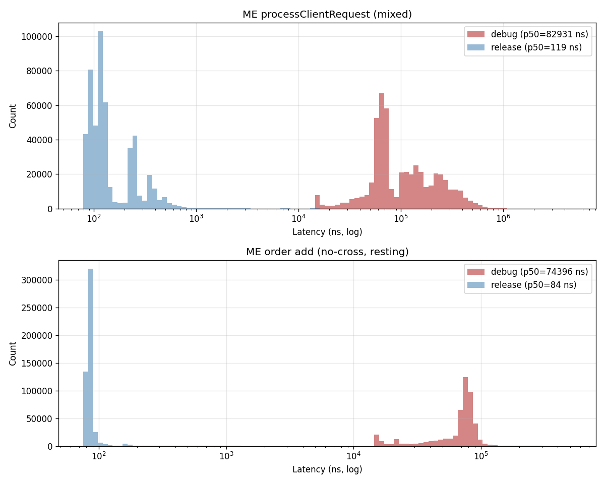
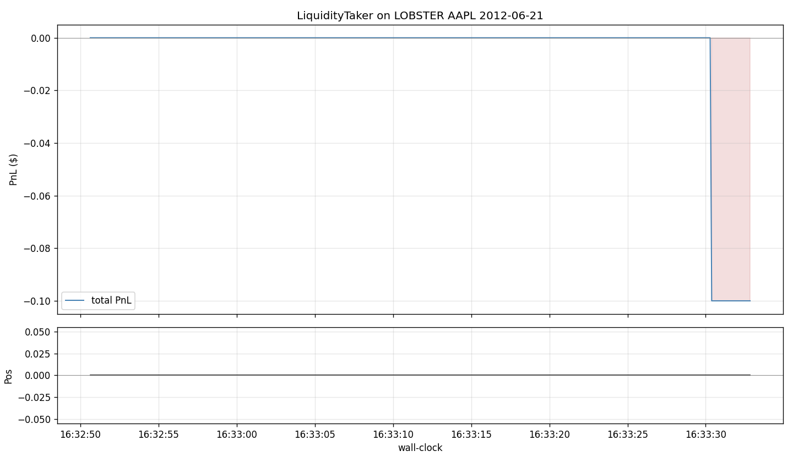

# NanoTrade

A low-latency trading system built in C++20, featuring a matching engine, order book, market data distribution, and algorithmic trading strategies with sub-microsecond order processing.

## Overview

NanoTrade is a full-stack electronic trading system that includes:

- **Matching Engine** - limit order book with price-time priority matching
- **Order Book** - efficient order management with O(1) operations using custom memory pools
- **Market Data Publisher** - multicast-based real-time market data distribution
- **Trading Strategies** - market making and liquidity taking with risk management
- **Backtesting Infrastructure** - historical replay and strategy evaluation (in progress)

## Architecture

```
                        ┌──────────────────────────────────┐
                        │           Exchange               │
                        │                                  │
Market Data  ◄──────────┤  Matching Engine                 │
(Multicast)             │    └─ Order Book (per ticker)    │
                        │    └─ FIFO Sequencer             │
                        │                                  │
                        │  Market Data Publisher           │
                        │  Snapshot Synthesizer            │
                        │  Order Server (TCP)              │
                        └──────────┬───────────────────────┘
                                   │
                          TCP / Multicast
                                   │
                        ┌──────────▼───────────────────────┐
                        │        Trading Client            │
                        │                                  │
                        │  Market Data Consumer            │
                        │    └─ Market Order Book          │
                        │    └─ Feature Engine             │
                        │                                  │
                        │  Strategy Engine                 │
                        │    └─ Market Maker               │
                        │    └─ Liquidity Taker            │
                        │    └─ Order Manager              │
                        │    └─ Risk Manager               │
                        │    └─ Position Keeper            │
                        │                                  │
                        │  Order Gateway (TCP)             │
                        └──────────────────────────────────┘
```

## Key Low-Latency Techniques

| Technique | Implementation | Purpose |
|---|---|---|
| Lock-free queues | `common/lf_queue.h` | Inter-thread communication without mutex overhead |
| Custom memory pool | `common/mem_pool.h` | Pre-allocated memory to avoid malloc/new latency |
| CPU affinity | `common/thread_utils.h` | Pin threads to specific cores to reduce context switches |
| Kernel-level I/O | `common/tcp_server.cpp` | epoll for efficient socket polling |
| Cache-friendly data | Packed structs, array-based order book | Minimize cache misses on hot paths |
| RDTSC timing | `common/perf_utils.h` | CPU cycle-level latency measurement |
| Async logging | `common/logging.h` | Non-blocking log writes to avoid I/O stalls on hot paths |

## Project Structure

```
├── common/                  # Core infrastructure
│   ├── lf_queue.h          # Lock-free SPSC queue
│   ├── mem_pool.h          # Fixed-size memory pool allocator
│   ├── thread_utils.h      # Thread creation with CPU affinity
│   ├── logging.h           # Low-latency async logger
│   ├── tcp_server.h/cpp    # TCP server with epoll
│   ├── mcast_socket.h/cpp  # UDP multicast socket
│   ├── time_utils.h        # Nanosecond timestamp utilities
│   └── perf_utils.h        # RDTSC cycle counter
│
├── exchange/                # Exchange-side components
│   ├── matcher/
│   │   ├── matching_engine.h/cpp    # Core matching logic
│   │   ├── me_order_book.h/cpp      # Limit order book
│   │   └── me_order.h/cpp           # Order representation
│   ├── market_data/
│   │   ├── market_data_publisher.h/cpp
│   │   └── snapshot_synthesizer.h/cpp
│   ├── order_server/
│   │   ├── order_server.h/cpp
│   │   └── fifo_sequencer.h         # Time-ordered request processing
│   └── exchange_main.cpp
│
├── trading/                 # Trading client components
│   ├── strategy/
│   │   ├── trade_engine.h/cpp       # Strategy orchestrator
│   │   ├── market_maker.h/cpp       # Market making strategy
│   │   ├── liquidity_taker.h/cpp    # Liquidity taking strategy
│   │   ├── order_manager.h/cpp      # Order lifecycle management
│   │   ├── risk_manager.h/cpp       # Pre-trade risk checks
│   │   ├── position_keeper.h        # Position and PnL tracking
│   │   └── market_order_book.h/cpp  # Client-side order book
│   ├── market_data/
│   │   └── market_data_consumer.h/cpp
│   ├── order_gw/
│   │   └── order_gateway.h/cpp
│   └── trading_main.cpp
│
├── benchmarks/              # Performance benchmarks
│   ├── logger_benchmark.cpp
│   ├── release_benchmark.cpp
│   └── hash_benchmark.cpp
│
└── scripts/                 # Build and run scripts
    ├── build.sh
    ├── run_exchange_and_clients.sh
    ├── run_clients.sh
    └── run_benchmarks.sh
```

## Building

### Prerequisites

- Linux (Ubuntu 22.04 recommended)
- C++20 compatible compiler (g++)
- CMake >= 3.10
- Ninja build system

```bash
sudo apt install -y cmake ninja-build g++
```

### Build

```bash
bash scripts/build.sh
```

This builds both Release and Debug targets.

## Running

### Start the exchange

```bash
./cmake-build-release/exchange_main &
sleep 10  # wait for exchange to initialize
```

### Start trading clients

```bash
# Market maker client
./cmake-build-release/trading_main 1 MAKER \
  100 0.6 150 300 -100 \
  60 0.6 150 300 -100 \
  150 0.5 250 600 -100 \
  200 0.4 500 3000 -100 \
  1000 0.9 5000 4000 -100 \
  300 0.8 1500 3000 -100 \
  50 0.7 150 300 -100 \
  100 0.3 250 300 -100 &

# Random order client
./cmake-build-release/trading_main 5 RANDOM &
```

### One-command run

```bash
bash scripts/run_exchange_and_clients.sh
```

### Run benchmarks

```bash
./cmake-build-release/logger_benchmark
./cmake-build-release/release_benchmark
./cmake-build-release/hash_benchmark

# Latency benchmark — writes CSVs for notebook analysis.
# latency_benchmark: debug build with in-hot-path logging (baseline).
# latency_benchmark_release: -O3 -march=native, logging compiled out of ME/OB hot path.
./build/latency_benchmark          # → benchmarks/results/*.csv
./build/latency_benchmark_release  # → benchmarks/results/release/*.csv
```

**Test machine for published latency numbers**: 12th Gen Intel Core i9-12900K
(24 threads, 12 cores), Linux (WSL2). Numbers from a different CPU / OS / isolation
setup are not directly comparable; `-march=native` produces CPU-specific instructions.

## Latency Results

Release build (`latency_benchmark_release`), 500k samples per path, benchmark thread
pinned to P-core 4. See [notebooks/latency_benchmark_analysis.ipynb](notebooks/latency_benchmark_analysis.ipynb)
for distribution plots and debug-vs-release comparison.

| Path | p50 | p90 | p99 | p99.9 |
|---|---|---|---|---|
| ME `processClientRequest` (mixed, crosses book) | 122 ns | 345 ns | 614 ns | 1.3 µs |
| ME order add (no-cross, resting) | 89 ns | 95 ns | 144 ns | 948 ns |



**Methodology**:

- Latency captured via `RDTSC` cycle counter (`common/perf_utils.h`) into a fixed-capacity
  ring-buffer (`common/latency_stats.h`) — no heap allocation on the hot path.
- Release build strips all hot-path logging via `-DNT_BENCHMARK_NO_LOG`, which compiles
  `logger_.log()` calls and `END_MEASURE` / `TTT_MEASURE` macros into `(void)0` without
  evaluating their arguments. Debug build of the same code path measures p50 ~74 µs,
  so logging overhead dominated the original numbers by ~3 orders of magnitude.
- Compiled with `-O3 -march=native -DNDEBUG -fno-omit-frame-pointer`.
- Order-book price hash is a dense `price - base_price_` offset into a per-book array
  (Phase 1.3A — replaced an earlier `price % N` modulo hash that silently collided on
  real market data). Subtract is cheaper than modulo on x86, which pushed the
  no-cross p99 down from 172 ns to 144 ns and p99.9 from 1.1 µs to 948 ns.

**Tail caveat**: `max` samples (~140 µs) are WSL2 hypervisor preemption events observed
during development — the virtual CPU is briefly descheduled by Hyper-V. These are an
environment artifact, not code latency. A bare-metal EC2 instance with `isolcpus` and
`SCHED_FIFO` would be expected to tighten the tail by 10-100×.

### Stop the system

```bash
pkill exchange_main
pkill trading_main
```

## Output

Results are written to log files in the project directory:

| Log File | Contents |
|---|---|
| `exchange_matching_engine.log` | Order matching, fills, RDTSC latency data |
| `exchange_order_server.log` | Client connections, order routing |
| `exchange_market_data_publisher.log` | Market data publication events |
| `trading_engine_*.log` | Strategy decisions, positions, PnL |
| `trading_order_gateway_*.log` | Order submission and responses |

## Deployment

Deployed on AWS EC2 (Ubuntu 22.04, x86_64) to leverage Linux-native low-latency features:

- `epoll` for kernel-level I/O multiplexing
- `pthread_setaffinity_np` for CPU core pinning
- `rdtsc` for CPU cycle-level latency measurement

## Backtesting

The same TradeEngine / MarketOrderBook / Strategy / OrderManager / PositionKeeper that
runs live also runs under a replay harness in [backtest/](backtest/) — only the edges
differ. `MarketDataConsumer` gets a `replay_incremental_queue` construction overload that
reads `MDPMarketUpdate`s from an in-process queue (fed by a CSV parser) instead of UDP
multicast; `OrderGateway`'s TCP leg is replaced by `FillSimulator`, an in-process
matching stub that executes aggressive orders against the next tick's opposite side with
qty truncation. No strategy code is modified.

```
[Replay] -> replay_queue -> [MarketDataConsumer (replay mode)]
                                           |
                           incoming_md_updates_ queue
                                           |
                                   [TradeEngine]
                        |                                     |
           outgoing_ogw_requests_ queue           incoming_ogw_responses_ queue
                        |                                     ^
                  [FillSimulator] ---------------------------/
                        |
                [PositionKeeper] <- [EquityRecorder] -> equity.csv
```

### Data sources

- **LOBSTER** — NASDAQ sample (`scripts/download_lobster.sh`). 10-level L2 + full message
  stream for AAPL/AMZN/GOOG/INTC/MSFT, 2012-06-21, one trading day each. Free, but one-day
  samples only. Good for engine validation and queue-position work (Phase 1.3).
- **Binance Spot aggTrades** (`scripts/download_binance.sh`). Every trade + `is_buyer_maker`
  flag; ~7 MB zip per day, ~200 MB per month for BTCUSDT. L2 depth is not published by
  Binance, so `BinanceAggTradesReplay` synthesizes a top-of-book from the aggressor flag.
  Good for multi-month statistical metrics.

### Run it

```bash
./scripts/download_lobster.sh                         # AAPL 2012-06-21 L2 sample
./build/backtest_main \
  --data-format lobster \
  --data data/lobster/AAPL/AAPL_2012-06-21_34200000_57600000_message_10.csv \
  --equity-csv benchmarks/backtest/lobster/equity.csv

./scripts/download_binance.sh BTCUSDT 2025-10 monthly # 40M aggTrades, ~3.3 GB csv
./build/backtest_main \
  --data-format binance-aggtrades \
  --data data/binance/spot/aggTrades/BTCUSDT/BTCUSDT-aggTrades-2025-10.csv \
  --clip 100 --threshold 0.05 --max-pos 100000 \
  --equity-csv benchmarks/backtest/binance/equity.csv
```

Analysis notebooks:
[notebooks/backtest_lobster.ipynb](notebooks/backtest_lobster.ipynb) and
[notebooks/backtest_binance.ipynb](notebooks/backtest_binance.ipynb) read `equity.csv`
and render PnL curves, drawdown, and fill-rate metrics.

### Current results (Phase 1.2 MVP)

The default LiquidityTaker rarely fires on either data set — not a bug in the engine but
a feature of an aggressive-take signal that seldom crosses its threshold on these feeds.
Statistically-meaningful Sharpe / drawdown / turnover numbers are a Phase 1.3 deliverable
(MarketMaker + queue-aware fills on LOBSTER; OBI signal on synthetic L1 for Binance).



## Roadmap

- [x] Core trading system (matching engine, order book, strategies)
- [x] AWS deployment
- [x] Latency benchmark + CPU-pinned release build (sub-200 ns p99 order insert)
- [x] Historical data replay engine (LOBSTER + Binance aggTrades)
- [x] Fill simulation + PnL / equity curve tracking
- [ ] Queue-position-aware fill simulator (Phase 1.3)
- [ ] Custom strategy: order book imbalance (OBI) on LOBSTER L2
- [ ] Multi-month statistical backtest with Sharpe / drawdown

## Acknowledgments

Based on *Building Low-Latency Applications with C++* by Sourav Ghosh. Extended with backtesting infrastructure, additional strategies, and historical data replay.
